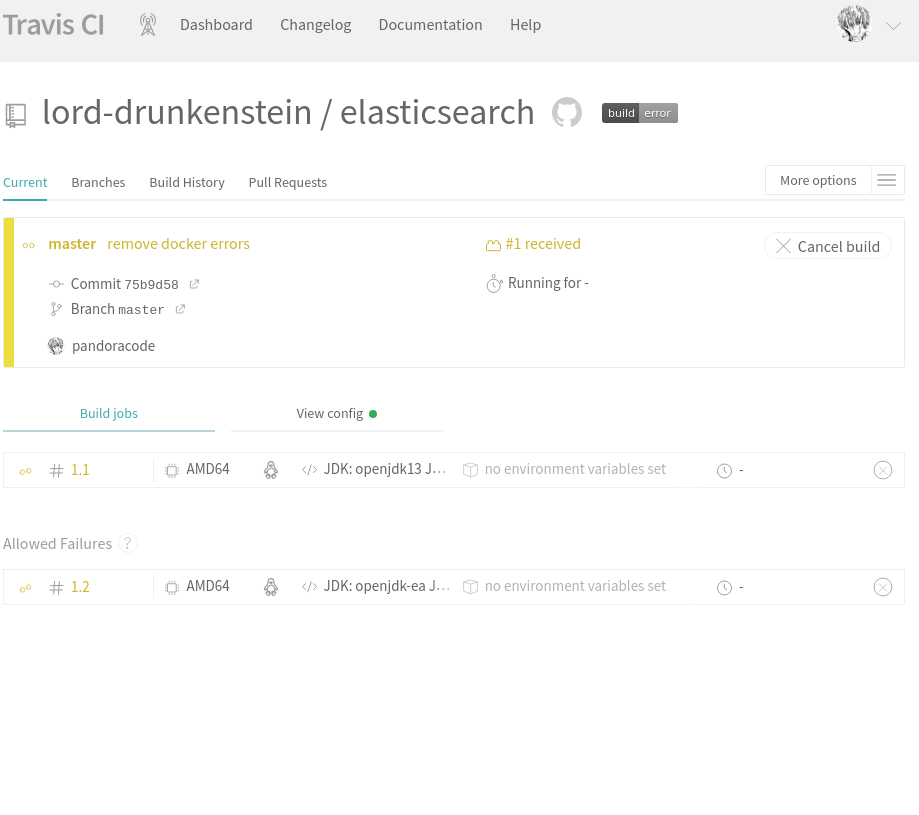

# log8371 : Ressources pour aider à terminer tp1

# Testing

Elastichsearch utilise gradle build system.

voir la documentaion de  gradle: https://docs.gradle.org/current/userguide/userguide.html

si vous utilisez Intellij IDE, voir: https://www.jetbrains.com/help/idea/work-with-gradle-tasks.html

IDE Eclipse: https://www.journaldev.com/8118/gradle-eclipse-plugin-tutorial

Pour exécuter des tests à l'aide de terminal, install gradle et exécutez:
~~~
gradle clean test --scan -p modules
~~~
Note : Vous n'avez pas besoin d'exécuter des tests pour l'ensemble du projet, seulement les modules que vous avez choisis.


## Integration continue avec Travis CI

## 1. Fork elasticsearch
commencer par Forking elasticsearch repo : https://github.com/elastic/elasticsearch.

## 2. Clone votre repo: 

```
git clone https://github.com/github username/elasticsearch.git
```

## 3. connectez-vous à travis-ci.org/ avec votre compte github.


## 4 . créez votre fichier .travis.yml avec votre configuration et ajoutez-le au dossier elastichsearch sur votre environnement local. commit et push au master. 

Consulter la documentation de travis-ci pour plus d'info: https://docs.travis-ci.com/
### Exemple de .travis.yml : 

~~~
language: java
install: true


dist: trusty
jdk:
  - openjdk13
  - openjdk-ea


matrix:
  allow_failures:
    - jdk: openjdk-ea

branches:
  only:
  - master
  - v7.6.0
    

script:
  - ./gradlew --continue clean build --scan -s -p modules/

~~~

Par exemple, si vous souhaitez déployer sur heroku, vous pouvez ajouter ce qui suit à votre .travis.yml
~~~
deploy:
  provider: heroku
  api_key:
    secure: "YOUR ENCRYPTED API KEY"
~~~

see also : https://devcenter.heroku.com/articles/bonsai

## 
Pour cet exemple, BUILD est déclenchée par tout nouveau commit apres push.



# Note!: 
### - Il existe d'autres solutions pour CI / CD d'elasticsearch. vous pouvez choisir lequel en fonction de votre plan d'intégration.
### Si vous rencontrez des échecs de build ou de test, documentez-les dans votre rapport de qualité et expliquez leur impact sur la qualité du système.
